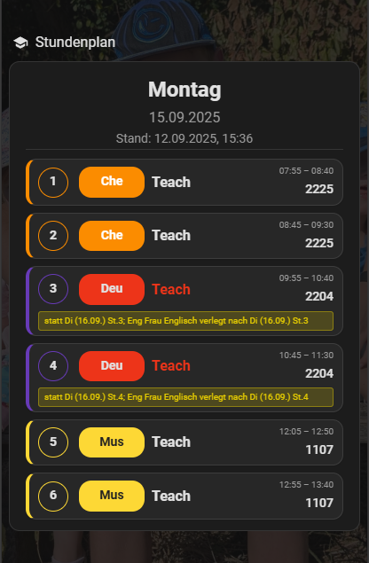
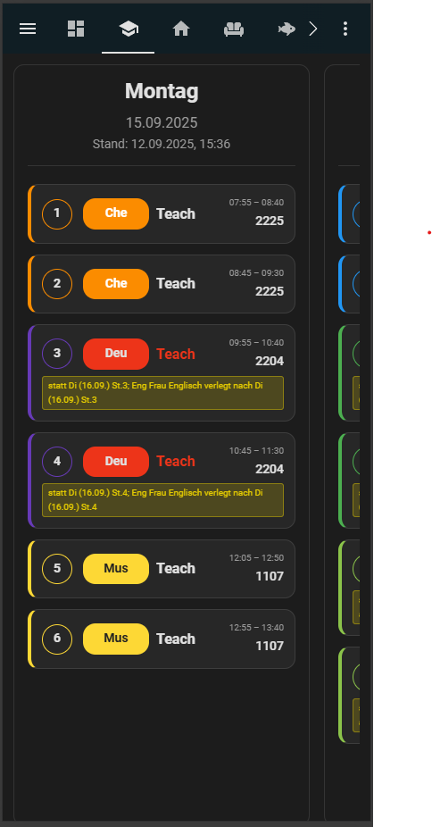
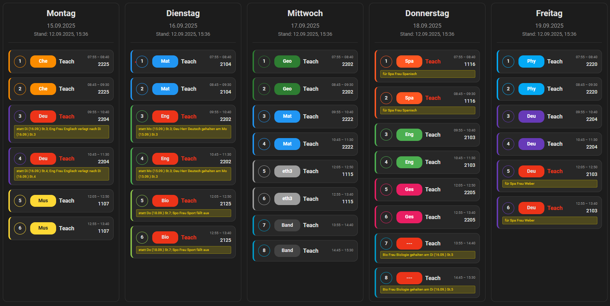

[Note] This Project was created with the help of AI.   
[Hinweis] Dieses Projekt wurde mit Hilfe von KI erstellt.

# School Schedule Card (Home Assistant)

Modern, responsive Lovelace card for school schedules. This repository is HACS‑compatible (category: Dashboard/Lovelace). The card renders lessons (including substitutions, daily notes, and last update) from a sensor entity or an inline configuration.

Image preview:  
  
  
  

---

## Features
- Week or Day view (Mon–Fri)
- Shows period, time, subject, teacher, room
- Detects and highlights substitutions/changes
- Notes per day
- Optional weekday auto‑fill
- Filters: show only certain courses (whitelist) and/or hide subjects/courses (blacklist)
- Compact “dense” mode for narrow displays
- Subject color accents (configurable in code)
- Supports newer sensor keys (e.g., st/beginn/ende/fa/le/ra/if/ku)

---

## Installation

### Via HACS (recommended)
1. Add this repository as a custom repository in HACS (category: “Lovelace”/“Dashboard”).
2. Install it.
3. Restart Home Assistant.
4. Check under Settings → Dashboards → Resources that the following resource exists:
   - URL: /hacsfiles/school-schedule-card/school-schedule-card.js
   - Type: Module

HACS takes the file from `dist/school-schedule-card.js` (see `hacs.json`).

### Manual
1. Copy the content of `dist/` to `<config>/www/community/school-schedule-card/` (create the folder if needed).
2. Add it as a resource in Lovelace:
   - URL: /local/community/school-schedule-card/school-schedule-card.js
   - Type: Module

Note: After updates, clear the browser cache (Ctrl+F5) or use cache busting.

---

## Usage (Lovelace examples)
Minimal example:
```yaml
type: custom:school-schedule-card
title: School Schedule
entity: sensor.your_schedule_sensor
view: week          # 'day' or 'week' (default: week)
show_date: true
```

Day view and “show tomorrow after 16:00”:
```yaml
type: custom:school-schedule-card
entity: sensor.your_schedule_sensor
view: day
tomorrow_after: "16:00"
```

Compact mode:
```yaml
type: custom:school-schedule-card
entity: sensor.your_schedule_sensor
dense: true
```

Show only specific courses (whitelist) and/or hide certain subjects (blacklist):
```yaml
type: custom:school-schedule-card
entity: sensor.your_schedule_sensor
courses:
  - band
  - fuba
hide_subjects:
  - mat
  - sport
```

Configure subject colors via config (override defaults):
```yaml
type: custom:school-schedule-card
entity: sensor.your_schedule_sensor
subject_colors:
  Mat: { bg: '#0000ff', fg: '#ffffff' }
  Deu: { bg: '#ff00ff', fg: '#000000' }
  Bio:
    bg: '#228B22'
    fg: '#ffffff'
  # Keys must match the subject short codes used in your data (case-sensitive)
```
If a subject is not present in subject_colors, the built-in default colors are used.

Inline data instead of entity (highest priority):
```yaml
type: custom:school-schedule-card
title: Schedule (Inline)
schedule:
  days:
    - date: "2025-09-01"
      lessons:
        - period: "1"
          time: "08:00"
          end: "08:45"
          subject: "Mat"
          teacher: "Mr Schmidt"
          room: "A101"
      hints:
        - "A new schedule applies from today."
      updated_at: "01.09.2025, 11:02"
```

---

## Supported data sources and formats
The card expects normalized data in the form:
```json
{
  "days": [
    {
      "name": "Monday",
      "date": "2025-09-01",
      "lessons": [
        {
          "period": "1",
          "time": "08:00",
          "end": "08:45",
          "subject": "Mat",
          "teacher": "Mr Schmidt",
          "room": "A101",
          "info": "",
          "isCourse": false,
          "isSubstitution": false
        }
      ],
      "hints": ["Text 1", "Text 2"],
      "updated_at": "01.09.2025, 11:02"
    }
  ]
}
```

Sensor attribute format (auto‑normalized), e.g.:
```json
{
  "state": true,
  "days": [
    {
      "date": "2025-08-31",
      "lessons": [
        {"st": "1", "beginn": "07:55", "ende": "08:40", "fa": "Che", "le": "SöFr", "ra": "2225", "if": "", "ku": true}
      ],
      "hints": ["A new schedule applies from today.", "____", "Cleaning duty this week:", "H5: 6/ 2", "MB: 10/ 2"],
      "updated_at": "01.09.2025, 11:02"
    }
  ]
}
```
The following keys are recognized and mapped to the normalized format:
- lessons[].period | st | hour
- lessons[].time | beginn | start
- lessons[].end | ende | until
- lessons[].subject | fa | subj (may also be an object with change markers)
- lessons[].teacher | le | t (may also be an object with change markers)
- lessons[].room | ra | r (may also be an object with change markers)
- lessons[].info | if | infoText
- lessons[].ku (bool/"true") → isCourse

Substitutions are detected when the info contains “vertret…” (substitute) or when subject/teacher are marked as “changed”.

Weekday detection: If the date is missing, the weekday is derived from the name (de/en). In week view, Mon–Fri are always sorted and filled with empty days if necessary.

---

## Options (configuration)
- title: Text in the header (default: “Schedule”)
- show_date: Show date under the weekday (true/false)
- show_footer_hints: Show daily notes under the list (true/false)
- view: "week" or "day" (default: week)
- tomorrow_after: HH:MM – In day view, show “tomorrow” after this time. If it falls on Fri/Sun, it jumps to next Monday.
- courses: List of course names (whitelist). Only course entries (ku=true) with a matching first word in the info text or the subject name are shown.
- hide_subjects: List of subjects/courses (blacklist). Entries whose subject (or the first word from info if subject is empty/"---") is in this list will be hidden.
- dense: Compact display mode (reduced paddings, tighter notes).

---

## Project structure
- `src/` – Modularized source code
  - `constants.js` – CARD_TAG, defaults, color table
  - `utils.js` – Parsers/helpers (normalization, dates, formatting)
  - `render.js` – Rendering functions for daily contents
  - `card.js` – Web component (custom element)
  - `main.js` – Registration (customElements + window.customCards)
  - `styles/`
    - `styles.scss` – Source styles (SCSS)
    - `styles.css` – Compiled styles (generated at build)
- `dist/` – Distributed bundled file `school-schedule-card.js`
- `hacs.json` – HACS metadata
- `package.json` – Build scripts (sass + esbuild)

## Development / Build
Requirements: Node.js >= 18

Install and build:
```bash
npm install
npm run build
```
This generates `src/styles/styles.css` from SCSS and then bundles everything to `dist/school-schedule-card.js` (ES module). The CSS is injected as text into the shadow DOM.

---

## Styling & colors
Subject colors are defined in `SUBJECT_COLORS` in the code, for example:
```js
const SUBJECT_COLORS = {
  Mat: {bg: '#2196f3', fg: '#fff'},
  Deu: {bg: '#673ab7', fg: '#fff'},
  // ...
}
```
You can extend or adjust them as needed.

---

## Tips & troubleshooting
- Nothing showing? Check the resource:
  - HACS: /hacsfiles/school-schedule-card/school-schedule-card.js (Type: Module)
  - Manual: /local/community/school-schedule-card/school-schedule-card.js (Type: Module)
- Check the browser console for errors.
- Ensure the sensor entity exists in Home Assistant and provides the `days` attribute.
- With inline configuration (`schedule.days`), that configuration takes precedence over the entity.
- Dates should be in YYYY‑MM‑DD to ensure sorting/week logic works correctly.
- Clear cache after updates (Ctrl+F5) or append a nocache parameter to the resource.

---

## Migration
- Before: one large, monolithic file `school-schedule-card.js`.
- Now: encapsulated modules in `src/` + distributed build in `dist/`.
- Styles were moved to SCSS.

## License
MIT

---

# Deutsch (Original)

# School Schedule Card (Home Assistant)

Moderne, responsive Lovelace-Karte für Schulstundenpläne. Dieses Repository ist HACS‑kompatibel (Kategorie: Dashboard/Lovelace). Die Karte rendert Schulstunden (inkl. Vertretungen, Hinweise und Aktualisierungsstand) aus einer Sensor‑Entität oder einer Inline‑Konfiguration.

Bildvorschau: siehe README.png im Projektroot.

---

## Features
- Wochen‑ oder Tagesansicht (Mo–Fr)
- Anzeige von Stunde, Zeit, Fach, Lehrkraft, Raum
- Erkennung und Hervorhebung von Vertretungen/Änderungen
- Hinweise/Notizen pro Tag
- Automatische Wochentags‑Füllung (optional)
- Filter für Kurse (Whitelist) und zum Ausblenden von Fächern/Kursen (Blacklist)
- Kompakter „dense“-Modus für schmale Displays
- Farb‑Akzente pro Fach (konfigurierbar im Code)
- Unterstützung neuer Sensordaten‑Schlüssel (z. B. st/beginn/ende/fa/le/ra/if/ku)

---

## Installation

### Über HACS (empfohlen)
1. Repository als benutzerdefiniertes Repository in HACS hinzufügen (Kategorie: „Lovelace“/„Dashboard“).
2. Installieren.
3. Home Assistant neu starten.
4. Unter Einstellungen → Dashboards → Ressourcen prüfen, dass folgende Ressource vorhanden ist:
   - URL: /hacsfiles/school-schedule-card/school-schedule-card.js
   - Typ: Modul

HACS nimmt die Datei aus `dist/school-schedule-card.js` (siehe `hacs.json`).

### Manuell
1. Den Inhalt des Ordners `dist/` nach `<config>/www/community/school-schedule-card/` kopieren (Ordner ggf. anlegen).
2. In Lovelace als Ressource einbinden:
   - URL: /local/community/school-schedule-card/school-schedule-card.js
   - Typ: Modul

Hinweis: Nach Updates Browser‑Cache leeren (Strg+F5) oder „Cache busting“ verwenden.

---

## Nutzung (Lovelace‑Beispiele)
Minimalbeispiel:
```yaml
type: custom:school-schedule-card
title: Schulstundenplan
entity: sensor.dein_stundenplan_sensor
view: week          # 'day' oder 'week' (Standard: week)
show_date: true
```

Tagesansicht mit „morgen nach 16:00 Uhr anzeigen“:
```yaml
type: custom:school-schedule-card
entity: sensor.dein_stundenplan_sensor
view: day
tomorrow_after: "16:00"
```

Kompakter Modus:
```yaml
type: custom:school-schedule-card
entity: sensor.dein_stundenplan_sensor
dense: true
```

Nur bestimmte Kurse (Whitelist) zeigen und/oder bestimmte Fächer ausblenden (Blacklist):
```yaml
type: custom:school-schedule-card
entity: sensor.dein_stundenplan_sensor
courses:
  - band
  - fuba
hide_subjects:
  - mat
  - sport
```

Inline‑Daten statt Entity (höchste Priorität):
```yaml
type: custom:school-schedule-card
title: Stundenplan (Inline)
schedule:
  days:
    - date: "2025-09-01"
      lessons:
        - period: "1"
          time: "08:00"
          end: "08:45"
          subject: "Mat"
          teacher: "Herr Schmidt"
          room: "A101"
      hints:
        - "Ab heute gilt ein neuer Stundenplan."
      updated_at: "01.09.2025, 11:02"
```

---

## Unterstützte Datenquellen und -formate
Die Karte erwartet normalisierte Daten in der Form:
```json
{
  "days": [
    {
      "name": "Montag",
      "date": "2025-09-01",
      "lessons": [
        {
          "period": "1",
          "time": "08:00",
          "end": "08:45",
          "subject": "Mat",
          "teacher": "Herr Schmidt",
          "room": "A101",
          "info": "",
          "isCourse": false,
          "isSubstitution": false
        }
      ],
      "hints": ["Text 1", "Text 2"],
      "updated_at": "01.09.2025, 11:02"
    }
  ]
}
```

Sensor‑Attribut‑Format (wird automatisch normalisiert), z. B.:
```json
{
  "state": true,
  "days": [
    {
      "date": "2025-08-31",
      "lessons": [
        {"st": "1", "beginn": "07:55", "ende": "08:40", "fa": "Che", "le": "SöFr", "ra": "2225", "if": "", "ku": true}
      ],
      "hints": ["Ab heute gilt ein neuer Stundenplan.", "____", "Reinigungsdienst in dieser Woche:", "H5: 6/ 2", "MB: 10/ 2"],
      "updated_at": "01.09.2025, 11:02"
    }
  ]
}
```
Folgende Schlüssel werden erkannt und auf das Normalformat gemappt:
- lessons[].period | st | hour
- lessons[].time | beginn | start
- lessons[].end | ende | until
- lessons[].subject | fa | subj (auch als Objekt mit Änderungsmarkierung möglich)
- lessons[].teacher | le | t (auch als Objekt mit Änderungsmarkierung möglich)
- lessons[].room | ra | r (auch als Objekt mit Änderungsmarkierung möglich)
- lessons[].info | if | infoText
- lessons[].ku (bool/"true") → isCourse

Vertretungen werden erkannt, wenn info „vertret…“ enthält oder subject/teacher als „changed“ markiert sind.

Wochentagserkennung: Wenn Datum fehlt, wird aus dem Namen (de/en) der Wochentag abgeleitet. In der Wochenansicht werden Mo–Fr stets sortiert und bei Bedarf mit leeren Tagen aufgefüllt.

---

## Optionen (Konfiguration)
- title: Text in der Kopfzeile (Standard: „Stundenplan“)
- show_date: Datum unter dem Wochentag anzeigen (true/false)
- show_footer_hints: Tages‑Hinweise unter der Liste anzeigen (true/false)
- view: "week" oder "day" (Standard: week)
- tomorrow_after: HH:MM – In der Tagesansicht wird nach dieser Zeit „morgen“ angezeigt. Fällt Fr/So hinein, wird bis zum nächsten Montag gesprungen.
- courses: Liste von Kursnamen (Whitelist). Nur Kurs‑Einträge (ku=true) mit passendem ersten Wort im info‑Text oder dem Fachnamen werden angezeigt.
- hide_subjects: Liste von Fächern/Kursen (Blacklist). Einträge, deren Fach (oder erstes Wort aus info, wenn Fach leer/„---“) in dieser Liste enthalten ist, werden ausgeblendet.
- dense: Kompakter Darstellungsmodus (reduzierte Abstände, kompaktere Hinweise).

---

## Projektstruktur
- `src/` – Modularisierter Quellcode
  - `constants.js` – CARD_TAG, Defaults, Farbtabelle
  - `utils.js` – Parser/Helfer (Normalisierung, Datum, Formatierung)
  - `render.js` – Rendering‑Funktionen für Tagesinhalte
  - `card.js` – Web Component (Custom Element)
  - `main.js` – Registrierung (customElements + window.customCards)
  - `styles/`
    - `styles.scss` – Quell‑Styles (SCSS)
    - `styles.css` – kompilierte Styles (wird beim Build erzeugt)
- `dist/` – Ausgelieferte, gebündelte Datei `school-schedule-card.js`
- `hacs.json` – HACS‑Metadaten
- `package.json` – Build‑Skripte (sass + esbuild)

## Entwicklung / Build
Voraussetzungen: Node.js >= 18

Installieren und bauen:
```bash
npm install
npm run build
```
Dies erzeugt `src/styles/styles.css` aus SCSS und bündelt anschließend alles nach `dist/school-schedule-card.js` (ES‑Modul). Die CSS wird als Text in den Shadow‑DOM injiziert.

---

## Styling & Farben
Die Farben für Fächer sind in `SUBJECT_COLORS` im Code definiert, z. B.:
```js
const SUBJECT_COLORS = {
  Mat: {bg: '#2196f3', fg: '#fff'},
  Deu: {bg: '#673ab7', fg: '#fff'},
  // ...
}
```
Diese können bei Bedarf erweitert oder angepasst werden.

---

## Tipps & Troubleshooting
- Keine Anzeige? Prüfe die Ressource:
  - HACS: /hacsfiles/school-schedule-card/school-schedule-card.js (Typ: Modul)
  - Manuell: /local/community/school-schedule-card/school-schedule-card.js (Typ: Modul)
- Browser‑Konsole auf Fehler prüfen.
- Prüfe, ob die Sensor‑Entity in Home Assistant existiert und das Attribut `days` bereitstellt.
- Bei Inline‑Konfiguration (`schedule.days`) hat diese Vorrang vor der Entity.
- Datum sollte als YYYY‑MM‑DD vorliegen, damit die Sortierung/Wochenlogik korrekt funktioniert.
- Cache leeren nach Updates (Strg+F5) oder Nocache‑Parameter an die Ressource hängen.

---

## Migration
- Vorher: eine große, monolithische Datei `school-schedule-card.js`.
- Jetzt: gekapselte Module in `src/` + ausgelieferter Build in `dist/`.
- Styles wurden in SCSS ausgelagert.

## Lizenz
MIT
